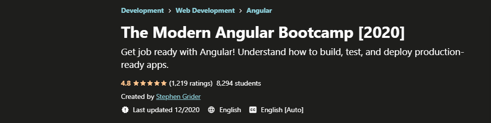

## Udemy: The Modern Angular Bootcamp [2020] by Stephen Grider
Course: (https://www.udemy.com/course/the-modern-angular-bootcamp/)  
Course length: <b>45 hours</b>

1. Master the fundamentals of Angular, including components, services, pipes, and directives
2. Create reusable components that you can plug-and-play to create dynamic, complex apps
3. Understand how to design and architect large apps, with a careful eye on code maintainability
4. Build modular apps that can easily be updated and changed
5. Get a handle on performance by leveraging lazy loading, supercharging the speed of your apps
6. Take a look at Typescript, which will help you write perfect code the first time, rather than encountering errors in the browser
7. Use RxJs to declaratively manage data throughout your app, leveraging built-in functions to transform your data
8. Test your code using Angular's excellent testing framework
9. Connect to backend databases like MySQL, Postgres, or MS SQL Server to add data to your app
10. Understand how to handle security in your Angular code

### Course Outline - Results
| Section  | Title  | Check  | Deploy  |
|---|---|---|---|
|  01 | Welcome Start Here  | &check; |   |
|  02 | Understanding Angular Template Syntax | &check;  | https://pw-rmc3408.vercel.app/ |
|  03 | Building Components | &check;  | https://cards.rmc3408.vercel.app/  |
|  04 | Exercise - Game |   |   |
|  05 | Mastering Pipes |   |   |
|  06 | Directives in Angular |   |   |
|  07 | The Module System |   |   |
|  08 | Routing and Navigation between pages |   |   |
|  09 | Lazy Loading with Modules |   |   |
|  10 | Advanced Component Routing |   |   |
|  11 | Advanced Component Reusability + Hooks |   |   |
|  12 | A typescript Overreview |   |   |
|  13 | Handling Data and HTTP request |   |   |
|  14 | App Security in Angular |   |   |
|  15 | RxJs from the Fundamentals |   |   |
|  16 | Bonus - Typescript + RxJs |   |   |
|  17 | Exercise - Photo Fetching App |   |   |
|  18 | Credit Card Payments with Reactive Forms |   |   |
|  19 | Simple Data Entry with Template Forms |   |   |
|  20 | Build a Fast-Paced Math Game |   |   |
|  21 | Custom Validators |   |   |
|  22 | Handling Authentication |   |   |
|  23 | More on Angular App Security |   |   |
|  24 | Build a Real Email Client |   |   |
|  25 | TypeScript - A deep Dive |   |   |
|  26 | Multi-feature Landing Page App |   |   |
|  27 | BONUS |   |   |

